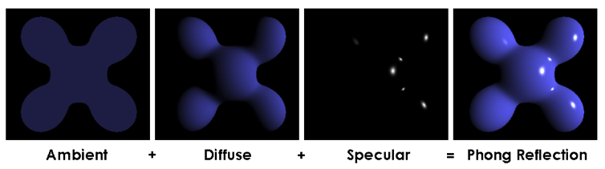
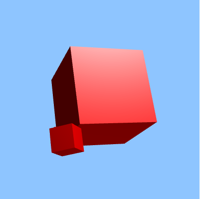
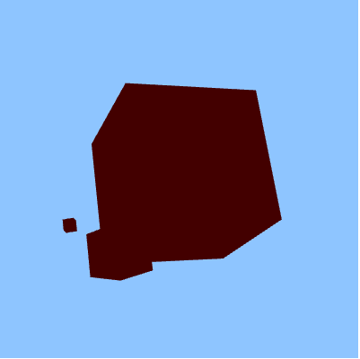
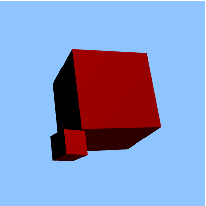
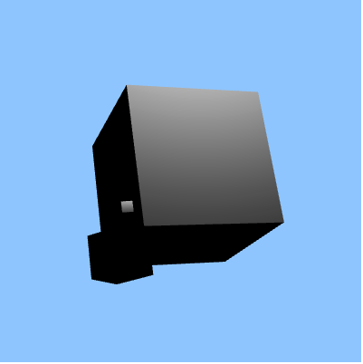
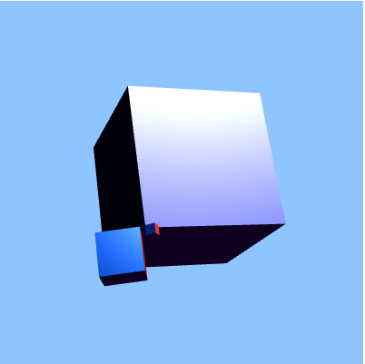

# CG_Project : Phong Shading tutorial
CC-NC-BY SeongHeon Kim

This Porject is WebGL shading tutorial

You can learn aobut 'Phong Shading 'by selecting ambient, diffuse and specular
or control coefficient of each of them.
You can also animate object and change color. 

But, 
select color (ambient, diffuse, specular)
change vertex or fragment shader and re render scene are not provided.

However,
Copy vertex and fragment shader code are provided.
You can easily implement your own Phong Shading Object ! 

This program are tested in google chrome invironment only.
other web browser would not support WebGL

# Features

  - Animation
> To start or stop rotating using 'Animation Rotate' and 'Stop Rotate' button.
> Also, you can speed up rotation of cube clicking button repetedly

  - Change Mode
> Phong shading
> Ambient Only
> Diffuse Only
> Specular Only
> Normal Color Mode (use normal vector as ambient and diffuse color)

  - Control Coefficient
> control coefficient of Ambient, Diffuse, Specular
> You can change intensity of each color

  - Shader Code
> You can copy shader code which tutorial used 
> Also, you can easily know about Phong shading's implementaion

# What is Phong shading 



The Phong reflection model (also called Phong illumination or Phong lighting) is an empirical model of the local illumination of points on a surface. 

In 3D computer graphics, it is sometimes referred to as "Phong shading", in particular if the model is used with the interpolation method of the same name and in the context of pixel shaders or other places where a lighting calculation can be referred to as “shading”.

Phong interpolation is not a part of this tutorial.

# Implementation of Phong shading
## vertex shader
* vertes shader source code
* phong shading calculate light and color in fragment shader
* So vertex shader only have goal that calculate position of vertex 
* and assign value for varying using attribute
```
attribute highp vec3 myVertex;
        attribute highp vec4 myColor;
        attribute highp vec2 myUV;
        attribute highp vec3 myNormal;
        attribute vec2 inputTexCoord;
        
        uniform mediump mat4 Pmatrix;
        uniform mediump mat4 Vmatrix;
        uniform mediump mat4 Mmatrix;
        uniform mediump mat4 Nmatrix;
        
        varying mediump vec4 color;
        varying mediump vec2 texCoord;
        varying mediump vec3 normalInterp;
        varying vec3 vertPos;
        
        void main(void)
        {
            vec4 vertPos4 = Vmatrix*vec4(myVertex, 1.0);
            vertPos = vec3(vertPos4) / vertPos4.w;
            normalInterp = vec3(Mmatrix * vec4(myNormal, 0.0));

            gl_Position = Pmatrix*Vmatrix*Mmatrix*vec4(myVertex, 1.0);
        }
```
## fragment shader

* varying comes form vertex shader
* normalInterp was Surfce normal vector
* vertPos was a Vertex Position

* uniform was set as global variable and it will be changed by HTML 

* const vec3 for light position, ambientColor, diffuseColor, specularColor

* normal vector was normalize to use
* lightDir was Light direction from obj
* reflectDir was reflected light vector
* viewDir was vector to viewer

* Phong shading use labercian suface which is perfectly diffuse reflector
So we use Labert's cosine Law to calculate specular

* Phong Shading = Ambient + Diffuse + Specular 
Ka, Kd, Ks was coefficient for tutorial study

```
precision mediump float;
      
      	varying vec3 normalInterp;
      	varying vec3 vertPos;
      
      	uniform int mode;
     	uniform float Ka;
      	uniform float Kd;
      	uniform float Ks;
      
      	const vec3 lightPos = vec3(5.0,1.0,1.0);
      	const vec3 ambientColor = vec3(0.3, 0.0, 0.0);
      	const vec3 diffuseColor = vec3(0.7, 0.0, 0.0);
     	const vec3 specColor = vec3(1.0, 1.0, 1.0);
      
     	void main() 
     	{
        	vec3 normal = normalize(normalInterp);
        	vec3 lightDir = normalize(lightPos - vertPos);
        	vec3 reflectDir = reflect(-lightDir, normal);
        	vec3 viewDir = normalize(-vertPos);
        
       	 	float lambertian = max(dot(normal, lightDir), 0.0);
        	float specular = 0.0;
        
        	if(lambertian > 0.0)
        	{
		       float specAngle = max(dot(reflectDir, viewDir), 0.0);
		       specular = pow(specAngle, 4.0);
        	}
	        gl_FragColor = vec4(Ka*ambientColor + Kd*lambertian*diffuseColor + Ks*specular*specColor, 1.0);
	        
	        if(mode == 2) gl_FragColor = vec4(Ka*ambientColor, 1.0);
	        
	        if(mode == 3) gl_FragColor = vec4(Kd*lambertian*diffuseColor, 1.0);
	        
	        if(mode == 4) gl_FragColor = vec4(Ks*specular*specColor, 1.0);
	    }
```

# result
## Phong

## Ambient Only

## Diffuse Only

## Specular Only

## Normal Color


# reference
WebGL applet by Prof. Thorsten Thormahlen. Modified by SeongHeon Kim for educational purpose